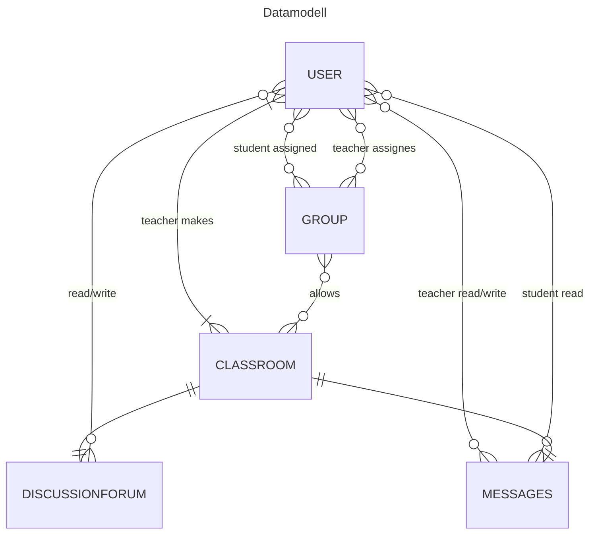
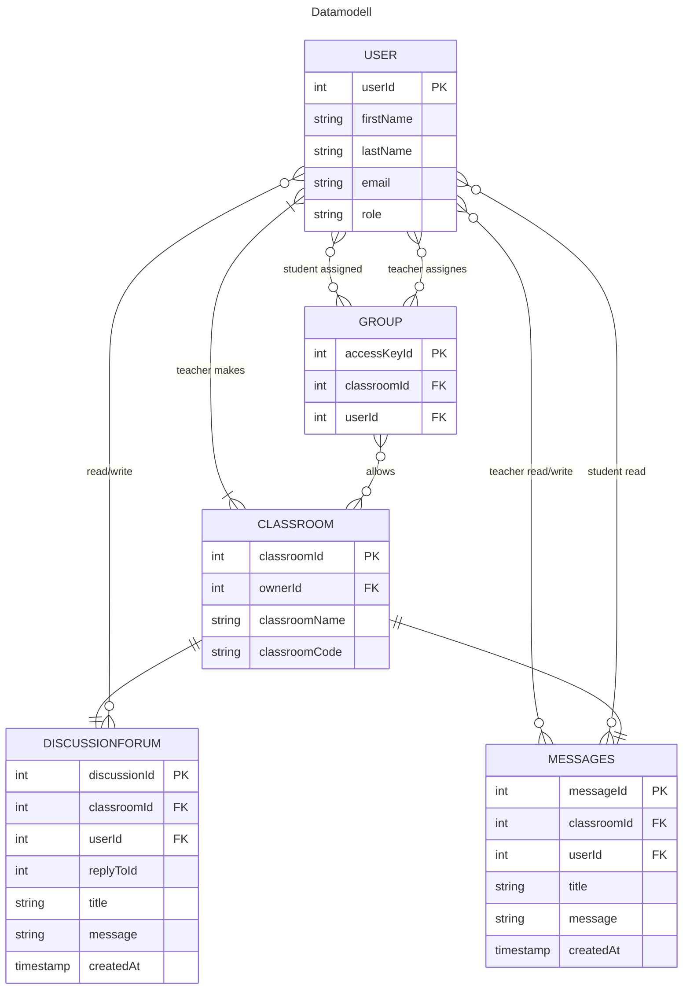

# Oppgavesett 1.4: Databasemodell og implementasjon for Nettbasert Undervisning

I dette oppgavesettet skal du designe en database for et nettbasert undervisningssystem. Les casen nøye og løs de fire deloppgavene som følger.

Denne oppgaven er en øving og det forventes ikke at du kan alt som det er spurt etter her. Vi skal gå gjennom mange av disse tingene detaljert i de nærmeste ukene. En lignende oppbygging av oppgavesettet, er det ikke helt utelukket at, skal bli brukt i eksamensoppgaven.

Du bruker denne filen for å besvare deloppgavene. Du må eventuelt selv finne ut hvordan du kan legge inn bilder (images) i en Markdown-fil som denne. Da kan du ta et bilde av dine ER-diagrammer, legge bildefilen inn på en lokasjon i repository og henvise til filen med syntaksen i Markdown. 

Det er anbefalt å tegne ER-diagrammer med [mermaid.live](https://mermaid.live/) og legge koden inn i Markdown (denne filen) på følgende måte:
```
```mermaid
erDiagram
    studenter 
    ...
``` 
Det finnes bra dokumentasjon [EntityRelationshipDiagram](https://mermaid.js.org/syntax/entityRelationshipDiagram.html) for hvordan tegne ER-diagrammer med mermaid-kode. 

## Case: Databasesystem for Nettbasert Undervisning

Det skal lages et databasesystem for nettbasert undervisning. Brukere av systemet er studenter og lærere, som alle logger på med brukernavn og passord. Det skal være mulig å opprette virtuelle klasserom. Hvert klasserom har en kode, et navn og en lærer som er ansvarlig.

Brukere kan deles inn i grupper. En gruppe kan gis adgang ("nøkkel") til ett eller flere klasserom.

I et klasserom kan studentene lese beskjeder fra læreren. Hvert klasserom har også et diskusjonsforum, der både lærere og studenter kan skrive innlegg. Til et innlegg kan det komme flere svarinnlegg, som det igjen kan komme svar på (en hierarkisk trådstruktur). Både beskjeder og innlegg har en avsender, en dato, en overskrift og et innhold (tekst).

## Del 1: Konseptuell Datamodell

**Oppgave:** Beskriv en konseptuell datamodell (med tekst eller ER-diagram) for systemet. Modellen skal kun inneholde entiteter, som du har valgt, og forholdene mellom dem, med kardinalitet. Du trenger ikke spesifisere attributter i denne delen.

**Ditt svar:**

Den konseptuelle datamodellen ser teknisk ut, men er relativ triviell. Konseptet bygger seg rundt en klasse bruker
som kan ha ulike roller, eksempelvis "LÆRER" eller "STUDENT". Jeg antar at kun brukere med rollen "LÆRER" har rettigheter
til å opprette klasserom og grupper. Det er ikke strengt nødvendig for en lærer å opprette en gruppe og derav null eller
flere til null eller flere.

Deretter kan en gruppe gi tilgang til ett eller flere klasserom og en student kan bli lagt inn i en
eller flere grupper av en bruker med rollen LÆERER. Dermed vil gruppen virke som en tilgangskontroll for klasserommet.
Både studenter og lærere kan bli lagt inn i en gruppe.

Videre kan brukere med rollen LÆRER skrive beskjeder til et klasserom og brukere med rollen STUDENTER kan lese dette
betinget at de har riktig gruppetilhørighet. 

Jeg antar at beskjeder og diskusjonsformuet arver tilgangskontrollen til klasserommet. I tabellen for beskjeder har lærere
lov til å både skrive og lese men studenter har kun lov til å lese. I diskusjonsformuet har både lærere og studenter
mulighet til å skrive ingen, en eller mange meldinger.



## Del 2: Logisk Skjema (Tabellstruktur)

**Oppgave:** Oversett den konseptuelle modellen til en logisk tabellstruktur. Spesifiser tabellnavn, attributter (kolonner), datatyper, primærnøkler (PK) og fremmednøkler (FK). Tegn et utvidet ER-diagram med [mermaid.live](https://mermaid.live/) eller eventuelt på papir.


**Ditt svar:**



## Del 3: Datadefinisjon (DDL) og Mock-Data

**Oppgave:** Skriv SQL-setninger for å opprette tabellstrukturen (DDL - Data Definition Language) og sett inn realistiske mock-data for å simulere bruk av systemet.


**Ditt svar:**

Se filen `init-scripts/01-init-database.sql`. Det som ikke er en del av svaret er policies for hvem som har lov til å
lese og skrive til de ulike tabellene basert på rollene til brukerne og hvilke grupper de tilhører.

## Del 4: Spørringer mot Databasen

**Oppgave:** Skriv SQL-spørringer for å hente ut informasjonen beskrevet under. For hver oppgave skal du levere svar med både relasjonsalgebra-notasjon og standard SQL.

### 1. Finn de 3 nyeste beskjeder fra læreren i et gitt klasserom (f.eks. klasserom_id = 1).

*   **Relasjonsalgebra:**
    > `τ_{created_at DESC}(σ_{classroom_id = 1}(limit(3)(messages)))`

*   **SQL:**
    ```sql
    SELECT * FROM messages
    WHERE classroom_id = 1
    ORDER BY (created_at) DESC
    LIMIT 3;
    ```

### 2. Vis en hel diskusjonstråd startet av en spesifikk student (f.eks. avsender_id = 2).

*   **Relasjonsalgebra**
    > Trenger ikke å skrive en relasjonsalgebra setning her, siden det blir for komplekst og uoversiktlig. 

*   **SQL (med `WITH RECURSIVE`):**

    Du kan vente med denne oppgaven til vi har gått gjennom avanserte SQL-spørringer (tips: må bruke en rekursiv konstruksjon `WITH RECURSIVE diskusjonstraad AS (..) SELECT FROM diskusjonstraad ...`)
    ```sql
    WITH RECURSIVE diskusjonstraad AS (
        SELECT discussion_id, user_id, reply_to_id, title, message, created_at FROM discussionforum
        WHERE discussion_id = 1

        UNION ALL

        SELECT df.discussion_id, df.user_id, df.reply_to_id, df.title, df.message, df.created_at FROM discussionforum AS df
        JOIN diskusjonstraad AS dt
        ON df.reply_to_id = dt.discussion_id
    )

    SELECT * FROM diskusjonstraad;
    ```

### 3. Finn alle studenter i en spesifikk gruppe (f.eks. gruppe_id = 1).

*   **Relasjonsalgebra:**
    > `(σ_{classroom_id = 1}(count(user_id)(messages)))`

*   **SQL:**
    ```sql
    SELECT COUNT(user_id) FROM groups
    WHERE classroom_id = 1;
    ```

### 4. Finn antall grupper.

*   **Relasjonsalgebra (med aggregering):**
    > `π(count(*)(π_{classroom_id}(group(classroom_id)(groups))))`

*   **SQL:**
    ```sql
    SELECT COUNT(*) FROM (
        SELECT classroom_id FROM groups
        GROUP BY classroom_id
    ) AS grouped
    ```

## Del 5: Implementer i postgreSQL i din Docker container

**Oppgave:** Gjenbruk `docker-compose.yml` fra Oppgavesett 1.3 (er i denne repositorien allerede, så du trenger ikke å gjøre noen endringer) og prøv å legge inn din skript for opprettelse av databasen for nettbasert undervsining med noen testdata i filen `01-init-database.sql` i mappen `init-scripts`. Du trenger ikke å opprette roller. 

Lagre alle SQL-spørringene dine fra oppgave 4 i en fil `oppgave4_losning.sql` i mappen `test-scripts` for at man kan teste disse med kommando:

```bash
docker-compose exec postgres psql -U admin -d data1500_db -f test-scripts/oppgave4_losning.sql
```
